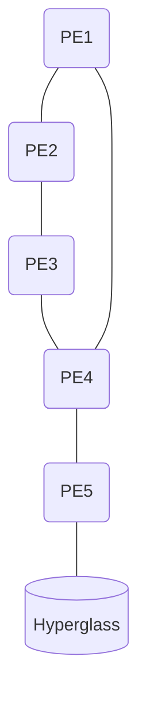

<head>
<meta name="google-site-verification" content="0U0_bkoO4bJB9GLfTo3mVkXevTLr1xBkLEUgwU6L0M0" />

</head>

[REPO on github](https://github.com/eidsivabredband/hyperglass-on-ubuntu/blob/master/README.md) for Mermaid diagrams.


# Installation

Some tips and tricks on how to install [Hyperglass 1.0.4](https://hyperglass.dev/) on a clean (and **dedicated**)  [Ubuntu22.04LTS](https://ubuntu.com/server)

Note: These workarounds will hopefully be unnecessary when [v2.0.0](https://github.com/thatmattlove/hyperglass/blob/main/README.md) arrives.


## Requirements

Hyperglass was written for the 18.04, and some preferences and modules (mainly phyton-related) have changes since then. 
This guide is not a complete manual to neither hyperglass nor python, but more a "how to get a basic system up-and-running"

Hyperglass was developed on Python version 3.6. Current Python-version on Ubuntu22.04 is 3.10, you need version 3.9 (possibly 3.11, we have not tried) due to a bug in one of the 3.10-libraries.

Following the [instructions](https://ubuntuhandbook.org/index.php/2022/10/python-3-11-released-how-install-ubuntu/), install Python3.9, replacing references to 3.11 with 3.9.
Remember to set Python3.9 as default.

Turning to [Manual Installation Instructions](https://hyperglass.dev/docs/getting-started#manual-installation "https://hyperglass.dev/docs/getting-started#manual-installation"), a few changes is needed.

```console
$ sudo apt install -y python3-dev python3-pip python3.9-distutils libjpeg-dev zlib1g-dev
```
and
```console
$ python3 --version
Python 3.9.17
```

For [Other Dependencies](https://hyperglass.dev/docs/getting-started/#other-dependencies "https://hyperglass.dev/docs/getting-started/#other-dependencies"), you need to make the keyring available to apt,

```console
$ curl -sL https://deb.nodesource.com/setup_14.x | sudo -E bash -

$ curl -sS https://dl.yarnpkg.com/debian/pubkey.gpg | sudo apt-key add -
$ echo "deb https://dl.yarnpkg.com/debian/ stable main" | sudo tee /etc/apt/sources.list.d/yarn.list
$ sudo chmod a+r /usr/share/keyrings/nodesource.gpg

$ sudo apt update
$ sudo apt install -y nodejs yarn redis-server

$ sudo systemctl enable redis-server
$ sudo systemctl restart redis-server
```

## Hyperglass installation

After having run 
```console
$ pip3 install hyperglass
```
(which we did as "root", in lack of good reasons), you need to uninstall the cryptography3.4.x that Hyperglass relies on - that version did not work for us;

```console
$ pip3 uninstall cryptography
$ pip3 install cryptography>=3.5
$ pip3 list | grep cryptography
cryptography                 41.0.1
```

That should be it!

After completing [Setup](https://hyperglass.dev/docs/setup "https://hyperglass.dev/docs/setup"), we have a few more tips for you:

## Configuring Hyperglass to your environment

We never got Scrapli working (possibly an issue between Scrapli and asyncSSH?), so we switched driver to [Netmiko](https://hyperglass.dev/docs/adding-devices "https://hyperglass.dev/docs/adding-devices")

Also, since we use Hyperglass to lookup /32-routes, we have turned off [force_cidr](https://hyperglass.dev/docs/adding-devices#ipv4 "https://hyperglass.dev/docs/adding-devices#ipv4") for IPv4.

Our purpose for installing Hyperglass, is to give a GUI- and also API -insight to the bgp-labeled routes in all VRF's. In order to do so, we could add *all* PE's as devices, or make sure that all VRF's routing-tables are exposed on *one* PE.



In this example-setup, all VRF's are defined on PE5, so that PE5 attracts all routes for the defined VRF's. This does not make PE5 usable for `ping` or `traceroute`-commands, unless you also configure an IP-address for every VRF on PE5. If you are only looking to get insight into the routingtables, you can add the VRF's to PE5 in /etc/hyperglass/devices.yaml (placement of this file depends on how you installed Hyperglass), and add "dummy"-IP's to the VRF:

```yaml
vrfs:
  - &default #<-- anchor
    name: global
    default: true
    display_name: your_global_rt
  - &vrf1 #<-- anchor
    name: vrf1 #<-- The VRF's name, as known by the device
    default: false
    display_name: your_choice
    ipv4:
      source_address: 10.10.10.10 #dummyIP
      force_cidr: false
    ipv6:
      source_address: aaaa:bbbb:cccc::1 #dummyIP
  - &vrf2 #<-- anchor
    name: name_as_given_in_router_config
    default: false
    display_name: your_choice
    ipv4:
      source_address: 10.10.10.10 #dummyIP
      force_cidr: false

our_credentials:
  - credential: &credential1 #<-- anchor
      username: my_username
      password: my_password           

pe_routers:
  - routers: &pe_routers #<-- anchor
      network: 
        name: your_choice
        display_name: my_AS_number
      credential: *credential1
      port: 22
      nos: must_specify
      driver: netmiko #our choice
      vrfs:
        - <<: *default
        - <<: *vrf1
        - <<: *vrf2
    

routers:
  - <<: *pe_routers
    name: my_router
    address: my_router_ip
    vrfs:
      - <<: *default
        ipv4:
          source_address: real_ip_address
          force_cidr: false
      - <<: *vrf1
        ipv4:
          source_address: dummy_IP
          force_cidr: false #<-- needs to be specified here, since we use YAML Anchors and Aliases
        ipv6: #<-- for this VRF, we also want to lookup IPv6-addresses
          source_address: dummy_IP
      - <<: *vrf2
        ipv4:
          source_address: dummy_IP
          force_cidr: false #<-- needs to be specified here, since we use YAML Anchors and Aliases
```

